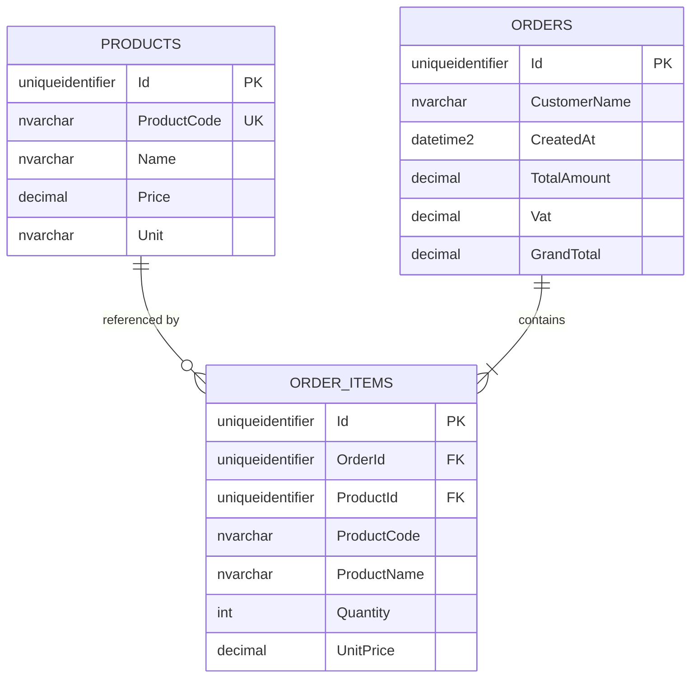

# Order Management System

Backend cho bài toán **quản lý đơn hàng (Order Management System)**, được xây dựng bằng **ASP.NET Core / .NET 9**, **Entity Framework Core** và **SQL Server**.

Project được tổ chức theo **Clean Architecture** với 4 layer: API, Application, Domain và Infrastructure; domain `Order` được thiết kế theo hướng **DDD Aggregate Root**, trong đó `OrderItem` thuộc về `Order` aggregate.

---

## 1. Mục tiêu

Hệ thống đáp ứng các nghiệp vụ chính của đề bài:

- Quản lý sản phẩm.
- Tạo đơn hàng gồm khách hàng và danh sách sản phẩm.
- Tự động tính tổng tiền.
- Tự động tính VAT 10%.
- Tự động tính tổng thanh toán.
- Xem danh sách đơn hàng.
- Lọc đơn hàng theo ngày tạo.
- Xem chi tiết đơn hàng.
- Thiết kế database quan hệ.
- Áp dụng Clean Architecture.
- Áp dụng các nguyên tắc DDD ở tầng Domain.
- Cung cấp RESTful API và Swagger UI.
- Validation request bằng FluentValidation.

---

## 2. Công nghệ

| Công nghệ | Sử dụng |
|---|---|
| .NET | 9.0 |
| ASP.NET Core Web API | RESTful API |
| Entity Framework Core | 9.0.0 |
| SQL Server | Database |
| FluentValidation | Request validation |
| Swashbuckle.AspNetCore | Swagger UI / OpenAPI |
| C# | Ngôn ngữ lập trình |

---

## 3. Kiến trúc

Project áp dụng **Clean Architecture**:

```text
┌─────────────────────────────────────────────┐
│              OrderManagement.API            │
│       Controllers / HTTP / Swagger          │
└──────────────────────┬──────────────────────┘
                       │
                       ▼
┌─────────────────────────────────────────────┐
│         OrderManagement.Application         │
│       DTOs / Services / Interfaces /        │
│              Validators                     │
└──────────────────────┬──────────────────────┘
                       │
                       ▼
┌─────────────────────────────────────────────┐
│            OrderManagement.Domain            │
│       Entities / Business Rules / DDD       │
└─────────────────────────────────────────────┘
                       ▲
                       │
┌──────────────────────┴──────────────────────┐
│       OrderManagement.Infrastructure         │
│   EF Core / SQL Server / Repositories       │
└─────────────────────────────────────────────┘
```

### Vai trò các layer

#### `OrderManagement.API`

Chịu trách nhiệm:

- HTTP endpoints.
- Request/response.
- Controller.
- Swagger UI.
- HTTP status code.

Các controller:

```text
ProductsController
OrdersController
```

#### `OrderManagement.Application`

Chứa use-case/application logic:

```text
DTOs
Services
Repository Interfaces
Validators
```

Service chính:

```text
IProductService → ProductService
IOrderService   → OrderService
```

Application chỉ phụ thuộc vào abstraction của repository, không phụ thuộc trực tiếp vào EF Core/SQL Server.

#### `OrderManagement.Domain`

Chứa business model và business rules:

```text
Product
Order
OrderItem
DomainException
```

Đây là layer trung tâm của hệ thống và không phụ thuộc vào Infrastructure.

#### `OrderManagement.Infrastructure`

Chịu trách nhiệm persistence:

```text
AppDbContext
Entity Configurations
ProductRepository
OrderRepository
Dependency Injection
SQL Server / EF Core
```

---

# 4. DDD Design

Project áp dụng các khái niệm DDD phù hợp với phạm vi bài toán.

## 4.1. Aggregate Root: `Order`

`Order` là **Aggregate Root** của Order Aggregate.

```text
Order Aggregate
│
├── Order
│   ├── Id
│   ├── CustomerName
│   ├── CreatedAt
│   ├── TotalAmount
│   ├── Vat
│   └── GrandTotal
│
└── OrderItem
    ├── Id
    ├── ProductId
    ├── ProductCode
    ├── ProductName
    ├── Quantity
    ├── UnitPrice
    └── Subtotal
```

Client/application không tạo `OrderItem` trực tiếp. `OrderItem` có constructor `internal` và được tạo thông qua:

```csharp
order.AddItem(...)
```

Điều này giúp `Order` kiểm soát trạng thái của aggregate.

## 4.2. Encapsulation

`Order` sử dụng collection private:

```csharp
private readonly List<OrderItem> _items = new();

public IReadOnlyCollection<OrderItem> Items
    => _items.AsReadOnly();
```

Các property domain sử dụng `private set`.

Ví dụ:

```csharp
public decimal TotalAmount { get; private set; }
public decimal Vat { get; private set; }
public decimal GrandTotal { get; private set; }
```

Nhờ đó, bên ngoài không thể tùy ý thay đổi tổng tiền của Order.

## 4.3. Domain behavior

Business logic được đặt trong Domain Entity thay vì chỉ nằm ở Controller.

Khi thêm item:

```csharp
order.AddItem(...)
```

`Order` sẽ:

1. Validate quantity.
2. Validate unit price.
3. Tạo `OrderItem`.
4. Thêm item vào aggregate.
5. Tính lại tổng tiền.

Logic tính tiền:

```text
Subtotal = Quantity × UnitPrice

TotalAmount = Σ Subtotal

VAT = TotalAmount × 10%

GrandTotal = TotalAmount + VAT
```

Phương thức:

```csharp
private void RecalculateTotals()
```

chịu trách nhiệm duy trì tính nhất quán của các giá trị tổng tiền.

## 4.4. Product Entity

`Product` là Domain Entity có:

```text
Id
ProductCode
Name
Price
Unit
```

Việc tạo Product được thực hiện thông qua constructor domain:

```csharp
new Product(
    productCode,
    name,
    price,
    unit);
```

Domain kiểm tra các invariant:

```text
ProductCode không được rỗng
Name không được rỗng
Price > 0
Unit không được rỗng
```

`Product` cũng có behavior:

```csharp
Update(...)
```

để thay đổi thông tin sản phẩm một cách có kiểm soát.

## 4.5. Invariant

Các invariant chính được bảo vệ tại Domain:

```text
Order:
- CustomerName không được rỗng.
- Quantity phải > 0.
- UnitPrice phải > 0.

Product:
- ProductCode không được rỗng.
- Name không được rỗng.
- Price phải > 0.
- Unit không được rỗng.

OrderItem:
- ProductId phải hợp lệ.
- ProductCode không được rỗng.
- ProductName không được rỗng.
- Quantity > 0.
- UnitPrice > 0.
```

### Domain Service

Project **không sử dụng Domain Service**, vì nghiệp vụ hiện tại có thể được encapsulate trực tiếp trong các Entity (`Order`, `Product`) mà không cần một behavior domain độc lập.

Đây là lựa chọn có chủ đích trong phạm vi bài toán hiện tại.

---

# 5. Database Design

Database sử dụng **SQL Server** và gồm 3 bảng:

```text
Products
   │
   │ 1 ───── N
   ▼
OrderItems
   ▲
   │ N ───── 1
   │
Orders
```

## 5.1. ERD



## 5.2. Quan hệ

### `Products` → `OrderItems`

```text
1 Product
   ↓
N OrderItems
```

`OrderItem.ProductId` tham chiếu `Products.Id`.

Foreign key sử dụng:

```text
ON DELETE RESTRICT
```

Do đó không thể xóa Product đang được OrderItem tham chiếu.

### `Orders` → `OrderItems`

```text
1 Order
   ↓
N OrderItems
```

`OrderItem.OrderId` tham chiếu `Orders.Id`.

Foreign key sử dụng:

```text
ON DELETE CASCADE
```

Khi Order bị xóa, các OrderItem thuộc Order đó cũng bị xóa.

## 5.3. Snapshot thông tin sản phẩm

`OrderItem` lưu:

```text
ProductId
ProductCode
ProductName
UnitPrice
```

Thay vì chỉ lưu `ProductId`.

Việc lưu `ProductCode`, `ProductName` và `UnitPrice` giúp OrderItem giữ lại thông tin sản phẩm/đơn giá tại thời điểm tạo đơn, tránh phụ thuộc hoàn toàn vào thông tin Product hiện tại.

> **Lưu ý nghiệp vụ:** Trong implementation hiện tại, `ProductCode` được dùng để tìm Product, nhưng `UnitPrice` của OrderItem được lấy từ `CreateOrderItemRequest`, không tự động lấy từ `Product.Price`.

---

# 6. SQL Database Script

Database script nằm tại:

```text
Database/SQLQuery1.sql
```

Script hiện tạo:

```text
Products
Orders
OrderItems
```

và các:

- Primary Key.
- Unique constraint cho `ProductCode`.
- Foreign Key.
- Check constraint cho `Price`.
- Check constraint cho `Quantity`.
- Check constraint cho `UnitPrice`.

Project hiện **không sử dụng EF Core Migration** để tạo database; database schema được cung cấp bằng SQL script.

---

# 7. API

Base URL mặc định:

```text
http://localhost:5133
```

HTTPS:

```text
https://localhost:7145
```

Các URL trên được cấu hình trong:

```text
OrderManagement.API/Properties/launchSettings.json
```

---

## 7.1. Product API

### Tạo sản phẩm

```http
POST /api/products
Content-Type: application/json
```

Request:

```json
{
  "productCode": "SP001",
  "name": "Laptop Dell",
  "price": 20000000,
  "unit": "Cái"
}
```

Response:

```http
201 Created
```

### Lấy danh sách sản phẩm

```http
GET /api/products
```

Response:

```json
[
  {
    "id": "00000000-0000-0000-0000-000000000000",
    "productCode": "SP001",
    "name": "Laptop Dell",
    "price": 20000000,
    "unit": "Cái"
  }
]
```

### Product validation

```text
ProductCode:
- Required
- Maximum 50 characters

Name:
- Required
- Maximum 200 characters

Price:
- Greater than 0

Unit:
- Required
- Maximum 50 characters
```

Nếu `ProductCode` đã tồn tại:

```http
409 Conflict
```

---

# 8. Order API

## 8.1. Tạo đơn hàng

```http
POST /api/orders
Content-Type: application/json
```

Request:

```json
{
  "customerName": "Nguyễn Văn A",
  "items": [
    {
      "productCode": "SP001",
      "quantity": 2,
      "unitPrice": 20000000
    },
    {
      "productCode": "SP002",
      "quantity": 1,
      "unitPrice": 500000
    }
  ]
}
```

Service thực hiện:

```text
1. Validate request.
2. Tìm Product theo ProductCode.
3. Nếu Product không tồn tại → 404.
4. Thêm item vào Order Aggregate.
5. Domain tự tính TotalAmount.
6. Domain tự tính VAT.
7. Domain tự tính GrandTotal.
8. Repository lưu Order.
```

## 8.2. Công thức

```text
Subtotal = Quantity × UnitPrice

TotalAmount = Σ Subtotal

VAT = TotalAmount × 10%

GrandTotal = TotalAmount + VAT
```

Ví dụ:

```text
SP001:
2 × 20.000.000 = 40.000.000

SP002:
1 × 500.000 = 500.000

TotalAmount = 40.500.000
VAT         = 4.050.000
GrandTotal  = 44.550.000
```

---

## 8.3. Lấy danh sách đơn hàng

```http
GET /api/orders
```

API hỗ trợ filter theo ngày tạo:

```http
GET /api/orders?from_date=2026-09-01&to_date=2026-09-14
```

### Quan trọng về tên parameter

Trong **code hiện tại**, Controller nhận query parameter bằng tên C#:

```csharp
[FromQuery] DateTime? fromDate,
[FromQuery] DateTime? toDate
```

Do đó URL thực tế của implementation hiện tại là:

```http
GET /api/orders?fromDate=2026-09-01&toDate=2026-09-14
```

Trong khi đề bài mô tả tên theo convention:

```text
from_date
to_date
```

**README giữ cả hai cách để phân biệt yêu cầu đề bài với implementation hiện tại.**

Nếu muốn API khớp 100% tên parameter của đề bài, có thể đổi Controller thành:

```csharp
[FromQuery(Name = "from_date")] DateTime? fromDate,
[FromQuery(Name = "to_date")] DateTime? toDate
```

Khi đó endpoint sẽ dùng:

```http
GET /api/orders?from_date=2026-09-01&to_date=2026-09-14
```

### Quy tắc filter

- `fromDate`: `CreatedAt >= fromDate`
- `toDate`: lấy toàn bộ ngày `toDate` bằng cách sử dụng mốc đầu ngày kế tiếp.

Ví dụ:

```text
fromDate = 2026-09-01
toDate   = 2026-09-14
```

sẽ lấy Order từ đầu ngày 01/09 đến trước đầu ngày 15/09.

---

## 8.4. Xem chi tiết đơn hàng

```http
GET /api/orders/{id}
```

Ví dụ:

```http
GET /api/orders/xxxxxxxx-xxxx-xxxx-xxxx-xxxxxxxxxxxx
```

Response chứa:

```text
Id
CustomerName
CreatedAt
Items
TotalAmount
Vat
GrandTotal
```

Mỗi item chứa:

```text
ProductId
ProductCode
ProductName
Quantity
UnitPrice
Subtotal
```

Nếu Order không tồn tại:

```http
404 Not Found
```

---

# 9. Validation

Project sử dụng **FluentValidation**.

## Create Product

```text
ProductCode → Required, max 50
Name        → Required, max 200
Price       → > 0
Unit        → Required, max 50
```

## Create Order

```text
CustomerName → Required, max 200
Items        → At least 1 item
```

## Create Order Item

```text
ProductCode → Required, max 50
Quantity    → > 0
UnitPrice   → > 0
```

Controller chuyển validation error thành:

```http
400 Bad Request
```

---

# 10. HTTP Status Codes

| Status Code | Trường hợp |
|---|---|
| `200 OK` | Request thành công |
| `201 Created` | Tạo Product thành công |
| `400 Bad Request` | Request/validation không hợp lệ |
| `404 Not Found` | Không tìm thấy Product hoặc Order |
| `409 Conflict` | ProductCode đã tồn tại |

---

# 11. Swagger UI

Project sử dụng:

```text
Swashbuckle.AspNetCore 6.6.2
```

Swagger được bật trong môi trường `Development`.

Sau khi chạy project, truy cập:

```text
https://localhost:7145/swagger
```

hoặc:

```text
http://localhost:5133/swagger
```

Swagger hỗ trợ:

- Xem API.
- Xem request/response.
- Test API trực tiếp.
- Kiểm tra HTTP status code.

---

# 12. Dependency Injection

Infrastructure đăng ký:

```text
IProductRepository → ProductRepository
IOrderRepository   → OrderRepository
AppDbContext        → SQL Server
```

Application đăng ký:

```text
IProductService → ProductService
IOrderService   → OrderService
```

Validators:

```text
IValidator<CreateProductRequest>
    → CreateProductValidator

IValidator<CreateOrderRequest>
    → CreateOrderValidator
```

---

# 13. Cấu trúc project

```text
OrderManagement/
│
├── OrderManagement.API/
│   ├── Controllers/
│   │   ├── OrdersController.cs
│   │   └── ProductsController.cs
│   ├── Program.cs
│   ├── Properties/
│   │   └── launchSettings.json
│   └── OrderManagement.API.csproj
│
├── OrderManagement.Application/
│   ├── DTOs/
│   │   ├── Orders/
│   │   └── Products/
│   ├── InterFaces/
│   │   ├── IOrderRepository.cs
│   │   └── IProductRepository.cs
│   ├── Services/
│   │   ├── IOrderService.cs
│   │   ├── IProductService.cs
│   │   ├── OrderService.cs
│   │   └── ProductService.cs
│   ├── Validators/
│   │   └── ...
│   └── OrderManagement.Application.csproj
│
├── OrderManagement.Domain/
│   ├── Entities/
│   │   ├── Order.cs
│   │   ├── OrderItems.cs
│   │   └── Product.cs
│   ├── Exceptions/
│   │   └── DomainException.cs
│   └── OrderManagement.Domain.csproj
│
├── OrderManagement.Infrastructure/
│   ├── Persistence/
│   │   ├── AppDbContext.cs
│   │   └── Configurations/
│   │       ├── OrderConfiguration.cs
│   │       ├── OrderItemConfiguration.cs
│   │       └── ProductConfiguration.cs
│   ├── Repositories/
│   │   ├── OrderRepository.cs
│   │   └── ProductRepository.cs
│   ├── DependencyInjection.cs
│   └── OrderManagement.Infrastructure.csproj
│
├── Database/
│   └── SQLQuery1.sql
│
└── OrderManagement.sln
```

> Khi đưa project lên GitHub, không nên commit các thư mục build sinh tự động như `bin/` và `obj/`. Nên thêm `.gitignore` phù hợp cho .NET.

---

# 14. Cài đặt môi trường

Yêu cầu:

- .NET SDK 9
- SQL Server
- Visual Studio 2022 / VS Code / Rider
- SQL Server Management Studio (khuyến nghị)

Kiểm tra .NET:

```bash
dotnet --version
```

Project target:

```xml
<TargetFramework>net9.0</TargetFramework>
```

---

# 15. Cấu hình Database

Infrastructure sử dụng:

```csharp
options.UseSqlServer(
    configuration.GetConnectionString("DefaultConnection"));
```

Connection string được đọc từ cấu hình ứng dụng:

```text
ConnectionStrings:DefaultConnection
```

Ví dụ:

```json
{
  "ConnectionStrings": {
    "DefaultConnection": "Server=.\\SQLEXPRESS;Database=OrderManagementDb;Trusted_Connection=True;TrustServerCertificate=True;"
  }
}
```

> **Lưu ý:** Hãy sử dụng connection string phù hợp với SQL Server instance trên máy của bạn. Không nên commit credential/password thật lên GitHub.

---

# 16. Tạo Database

## Bước 1 — Tạo database

Trong SQL Server:

```sql
CREATE DATABASE OrderManagementDb;
GO
```

## Bước 2 — Chạy SQL script

Mở:

```text
Database/SQLQuery1.sql
```

Sau đó chạy script.

Script bắt đầu bằng:

```sql
USE OrderManagementDb;
```

và tạo:

```text
Products
Orders
OrderItems
```

---

# 17. Chạy project

Mở terminal tại thư mục chứa:

```text
OrderManagement.sln
```

Restore:

```bash
dotnet restore
```

Build:

```bash
dotnet build
```

Run:

```bash
dotnet run --project OrderManagement.API
```

Sau khi chạy thành công, API có thể truy cập tại:

```text
http://localhost:5133
```

hoặc:

```text
https://localhost:7145
```

Swagger:

```text
https://localhost:7145/swagger
```

---

# 18. Quick Test

## Bước 1 — Tạo Product

```http
POST /api/products
```

```json
{
  "productCode": "SP001",
  "name": "Laptop Dell",
  "price": 20000000,
  "unit": "Cái"
}
```

## Bước 2 — Tạo Product thứ hai

```http
POST /api/products
```

```json
{
  "productCode": "SP002",
  "name": "Chuột Logitech",
  "price": 500000,
  "unit": "Cái"
}
```

## Bước 3 — Tạo Order

```http
POST /api/orders
```

```json
{
  "customerName": "Nguyễn Văn A",
  "items": [
    {
      "productCode": "SP001",
      "quantity": 1,
      "unitPrice": 20000000
    },
    {
      "productCode": "SP002",
      "quantity": 2,
      "unitPrice": 500000
    }
  ]
}
```

Kết quả:

```text
TotalAmount = 21.000.000
VAT         = 2.100.000
GrandTotal  = 23.100.000
```

## Bước 4 — Xem Order

```http
GET /api/orders/{id}
```

## Bước 5 — Lọc Order theo ngày

Implementation hiện tại:

```http
GET /api/orders?fromDate=2026-09-01&toDate=2026-09-14
```

---

# 19. Requirement Checklist

Đối chiếu với yêu cầu bài test:

## Functional Requirements

- [x] Tạo Product — `POST /api/products`
- [x] Product gồm `product_code`, `name`, `price`, `unit`
- [x] Danh sách Product — `GET /api/products`
- [x] Tạo Order — `POST /api/orders`
- [x] Order gồm CustomerName và danh sách sản phẩm
- [x] Item gồm `product_code`, `quantity`, `unit_price`
- [x] Tự tính `total_amount`
- [x] Tự tính VAT 10%
- [x] Tự tính `grand_total`
- [x] Danh sách Order — `GET /api/orders`
- [x] Filter Order theo `fromDate` / `toDate` trong implementation
- [x] Chi tiết Order — `GET /api/orders/{id}`
- [x] Chi tiết trả về customer, items, total, VAT và grand total

## Technical Requirements

- [x] .NET 9
- [x] Clean Architecture
- [x] API layer
- [x] Application layer
- [x] Domain layer
- [x] Infrastructure layer
- [x] DDD Entity
- [x] DDD Aggregate Root (`Order`)
- [x] Domain behavior / invariant
- [x] Không cần Domain Service cho nghiệp vụ hiện tại
- [x] Entity Framework Core
- [x] SQL Server
- [x] RESTful API
- [x] Swagger UI
- [x] FluentValidation
- [x] SQL Table Script

## Bonus

Các bonus dưới đây **chưa được triển khai trong source hiện tại**:

- [ ] Docker
- [ ] Unit Test
- [ ] AutoMapper
- [ ] CQRS
- [ ] MediatR

---

# 20. Known Limitations / Notes

Project hiện tập trung vào phạm vi chức năng của đề bài.

Chưa triển khai:

- Authentication / Authorization.
- JWT.
- Role / Permission.
- Update Product API.
- Delete Product API.
- Update Order API.
- Delete/Cancel Order API.
- Pagination.
- Unit Test.
- Docker.
- CQRS/MediatR.
- AutoMapper.

`app.UseAuthorization()` hiện có trong pipeline nhưng project chưa cấu hình Authentication/Authorization cụ thể.

Ngoài ra, `Product.Update(...)` đã tồn tại ở Domain nhưng chưa được expose thành HTTP endpoint.

---

# 21. Possible Improvements

Nếu tiếp tục phát triển production version, có thể bổ sung:

### Product

```text
PUT    /api/products/{id}
DELETE /api/products/{id}
GET    /api/products/{id}
GET    /api/products?keyword=...
```

### Order

```text
GET    /api/orders/{id}
PUT    /api/orders/{id}
DELETE /api/orders/{id}
POST   /api/orders/{id}/cancel
```

### Technical

- Global Exception Handling Middleware.
- Structured Logging.
- Unit Test / Integration Test.
- Docker Compose.
- CI/CD.
- Authentication + JWT.
- Authorization.
- Pagination.
- API Versioning.
- EF Core Migration.
- CQRS/MediatR khi business logic mở rộng.

---

# 22. Submission

## Repository

GitHub/GitLab:

```text
TODO: Add repository URL
```

Sau khi tạo repository, cập nhật URL ở trên.

## Reviewer / Git email

Theo yêu cầu bài test, thêm email:

```text
lelinhbk@gmail.com
```

vào Git repository nếu được yêu cầu quyền truy cập/contributor.

Ví dụ kiểm tra Git identity:

```bash
git config user.name
git config user.email
```

Nếu cần đặt email cho repository:

```bash
git config user.email "lelinhbk@gmail.com"
```

> Không commit password, connection string có credential thật hoặc secret vào repository.

## Submission checklist

- [x] Source code
- [x] `README.md`
- [x] SQL database script
- [x] ERD trong README
- [x] API documentation
- [x] Hướng dẫn setup
- [x] Hướng dẫn chạy project
- [ ] GitHub/GitLab repository URL
- [ ] Add reviewer email theo yêu cầu đề bài

---

# 23. License

Project chưa khai báo license cụ thể.

---

# 24. Author

**Order Management System**

Backend technologies:

```text
ASP.NET Core / .NET 9
Entity Framework Core 9
SQL Server
FluentValidation
Swagger / OpenAPI
Clean Architecture
DDD
```
